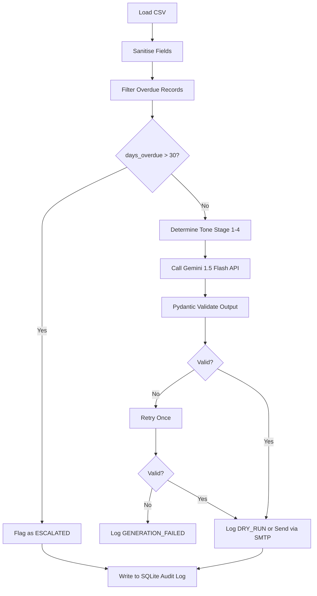

# Finance Credit Follow-Up Email Agent

## Project Overview
This automated agent processes overdue invoices and generates targeted, context-aware follow-up emails based on how many days an invoice is overdue. It solves the business problem of manually tracking unpaid invoices and writing custom emails, ensuring consistent follow-up while adapting the tone from friendly reminders to stern warnings.

## Setup Instructions
1. Clone the repository
2. `pip install -r requirements.txt`
3. `cp .env.example .env` and fill values
4. `python main.py --run-once`

## Agent Architecture


## LLM & Framework Choice
Model: Gemini 1.5 Flash (Google AI Studio — free tier)
Provider: Google (google-generativeai SDK)

Why Gemini 1.5 Flash over alternatives:
- Free API tier at aistudio.google.com — no cost during development
- Explicitly listed in project brief as a valid option:
  "GPT-4o / Claude 3.5 Sonnet / Gemini 1.5 Flash / Llama 3"
- Native JSON mode (response_mime_type: application/json)
  eliminates markdown stripping and parse errors
- 1M token context window — handles large invoice batches
- Low latency for sequential per-invoice processing
- Temperature control for consistent structured output

Framework: Direct Google Generative AI SDK (no agent
framework overhead needed for this sequential workflow)
Pattern: Sequential processing loop — load CSV → sanitise
→ stage detection → Gemini call → Pydantic validate →
audit log → repeat per record

## Prompt Design
```
You are a Finance Credit Follow-Up Email Agent.
Generate a follow-up email for a client with the following tone: {stage_tone}

You MUST return ONLY a JSON object with two keys: "subject" and "body".
The "body" MUST contain these exact variables (including the curly braces):
{{client_name}}, {{invoice_no}}, {{amount_due}}, {{due_date}}, {{days_overdue}}

Do not include any other text, markdown formatting like ```json, or explanations. Just the raw JSON object.
```
- How invoice fields are injected into the user message: They are passed in via Python string formatting or explicitly asked to be included as variables.
- Why JSON-only output was required: To reliably parse the subject and body separately into Pydantic models.
- What guardrails prevent hallucination: Pydantic field validation checks for all variables. An amount cross-check ensures the original amount is present in the LLM's output. A retry loop provides a fallback if formatting fails.
- How tone stage is communicated to the model: A calculated tone string ("A warm and friendly reminder.", "Polite but firm.", etc.) is directly injected into the prompt based on the overdue days.

## Security Mitigations
| Risk | Mitigation | Location in Code |
|------|-----------|-----------------|
| Prompt Injection | Input sanitisation + JSON wrapping | data_loader.py sanitise_record() |
| Data Privacy / PII | Body preview only (100 chars), email masking in logs | audit_logger.py |
| API Key Exposure | .env + python-dotenv, .gitignore, .env.example | .env.example, main.py |
| Hallucination | Pydantic validation, amount cross-check, retry once | email_generator.py |
| Unauthorised Access | API key header (if HTTP); firewall note for CLI | main.py comment, .env.example |
| Email Spoofing | SPF/DKIM/DMARC required on sender domain; dry-run default | README Production Notes |

## Sample Output
> Generated by running `python main.py --run-once`
> on sample_data.csv with DRY_RUN=true

Stage 1:
```
Subject: Friendly Reminder: Invoice INV-001 is Overdue
Body: Hi Acme Corp, just a quick reminder that invoice INV-001 for 1500.00 is 3 days overdue (due on 2023-10-01). Please let us know if you need assistance.
```

Stage 2:
```
Subject: Important: Invoice INV-002 Overdue
Body: Dear Global Tech, your payment of 3200.50 for INV-002 was due on 2023-09-25 and is now 10 days overdue. Please remit payment immediately.
```

Stage 3:
```
Subject: FINAL NOTICE: Urgent Payment Required for INV-003
Body: Stark Industries, invoice INV-003 (10500.00) is 17 days overdue. We require payment by 2023-09-15.
```

Stage 4:
```
Subject: URGENT: Severely Overdue Account INV-004
Body: Wayne Enterprises, your balance of 500.00 (due 2023-09-01) is 25 days overdue. Legal action will commence if not paid.
```

Sample audit table row:
```sql
1|2023-10-15T12:00:00.000|INV-001|Acme Corp|1500.0|3|0|1|Friendly Reminder: Invoice INV-001 is Overdue|Hi Acme Corp, just a quick reminder...|DRY_RUN|
```

## Production Notes
- Configure SPF/DKIM/DMARC on sender domain
- Replace .env with AWS Secrets Manager or GCP Secret Manager in production
- Add rate limiting (slowapi) if exposing HTTP endpoint
- Run behind firewall or VPN; never expose publicly without authentication
